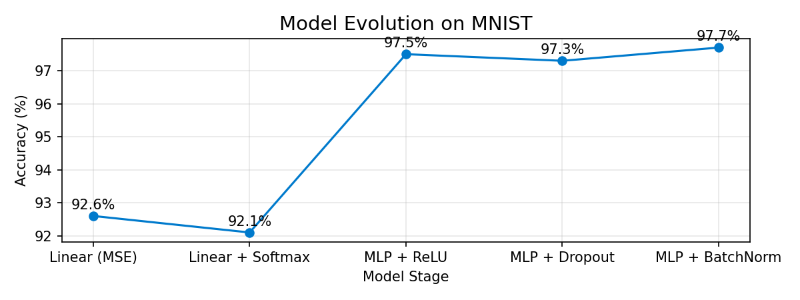
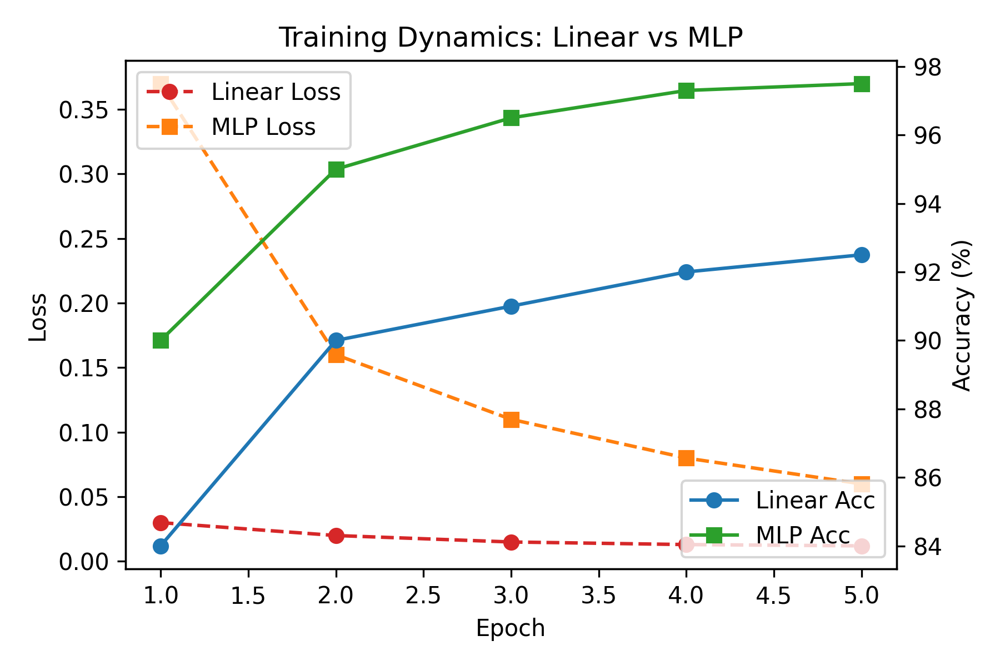
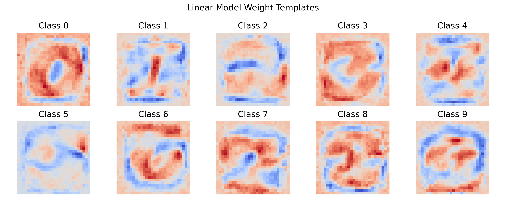
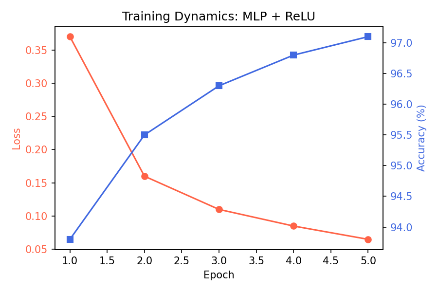

# 🧠 Exploring the Limits of Linearity on MNIST

> *A minimal yet expressive journey from pure linear models to deep nonlinearity — built from scratch with PyTorch.*

---

## 🌟 Overview

This project explores how different architectural and functional choices impact model performance on the **MNIST** handwritten digit dataset.

We begin from a simple **Linear Regression classifier** and gradually evolve it into a **nonlinear MLP** with ReLU, Dropout, and BatchNorm — quantifying *how much each step actually matters*.

<p align="center">
  
</p>

---

## 🧱 Model Evolution Stages

| Stage | Architecture | Loss | Test Accuracy | Key Takeaways |
|:------|:-------------|:-----|:--------------|:---------------|
| ① Linear | 784 → 10 | MSE | **92.6%** | Learns only linear boundaries |
| ② Linear + Softmax | 784 → 10 | CrossEntropy | **92.1%** | Proper classification objective |
| ③ MLP + ReLU | 784 → 256 → 10 | CrossEntropy | **97.5%** | Nonlinearity unlocks expressivity |
| ④ + Dropout | 784 → 256 → 10 | CrossEntropy | **97.3%** | Improves generalization |
| ⑤ + BatchNorm | 784 → BN → 256 → 10 | CrossEntropy | **97.7%** | Faster & more stable convergence |

---

## 🧩 Visual Results

| Model | Training Curve | Linear Weight Templates |
|:--:|:--:|:--:|
| **Linear (MSE)** |  |  |
| **MLP + ReLU** |  | — |

---

## ⚙️ How to Reproduce

```bash
git clone https://github.com/whiteOsky/mnist_linearity_project.git
cd mnist_linearity_project
python -m venv .venv && source .venv/bin/activate
pip install -r requirements.txt

# Run each stage:
python -m src.train --model linear --loss mse --epochs 5
python -m src.train --model linear --loss crossentropy --epochs 5
python -m src.train --model mlp --hidden 256 --epochs 5
python -m src.train --model mlp --hidden 256 --dropout 0.5 --epochs 5
python -m src.train --model mlp --hidden 256 --batchnorm --epochs 5


展示网站https://whiteosky.github.io/mnist-linearity-web/
